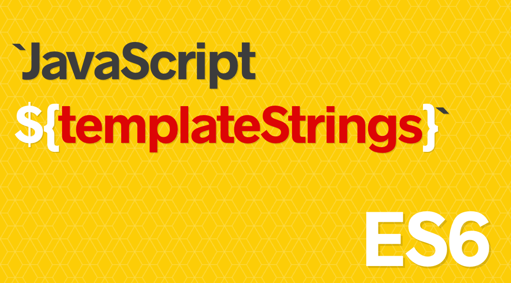

In JavaScript, when you want to put a variable inside of a string, it's a pain in the ass because you have to stop your string, concatenate on the variable, and then open your string again and keep going.

```js
var name = "Snickers";
var age = 2;
var sentence = "My dog " + name + " is " + age * 7 + " years old.";
```

Most other programming languages have the ability to just drop your variables right inside of a string and interpolate it, but until now JavaScript hasn't had this.

What ends up happening is you forget one of your closing quotes, and you get an error and it tells you it's on line 3. You say "Of course it's on line 3, but I don't know where it is!"

We can fix all of that with what's called **template strings**, or **template literals** in ES6. In JavaScript we have double quotes and single quotes to make a string. Now we have a third way to make a string, and that is with back-ticks, which I've been using in most of my examples so far.

Let's take the above code. How do we convert it to ES6 template strings? We switch to using back ticks and then use the `${}` syntax inside those strings!

```js
const name = "Snickers";
const age = 2;
const sentence = `My dog ${name} is ${age * 7} years old.'`;
console.log(sentence);
```

That is going to pop in, or <em>interpolate</em>, the `name and age` variables that we previously had set there by using \$, curly brackets and the variable name.

You can also run JavaScript straight away inside of these curly brackets, too. You can add in a variable, you can run a function, you can run any JavaScript inside of the curly brackets — including more template strings, but we will talk more about that later.

I'm calculating the age in dog years right inside of `sentence by using ${age * 7}, so our console.log will just show a regular sentence, My dog Snickers is 14 years old.`

That's a very basic overview of template strings. However there's quite a bit more that we can do with them. It can be very handy other than just being able to stick variables inside of it — see you in the next one!
